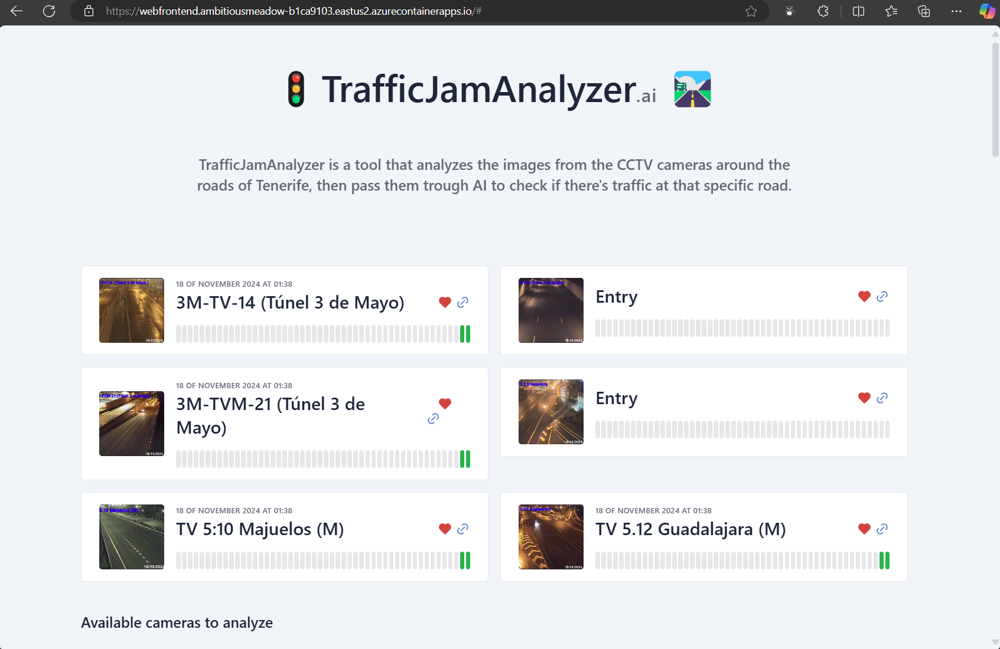
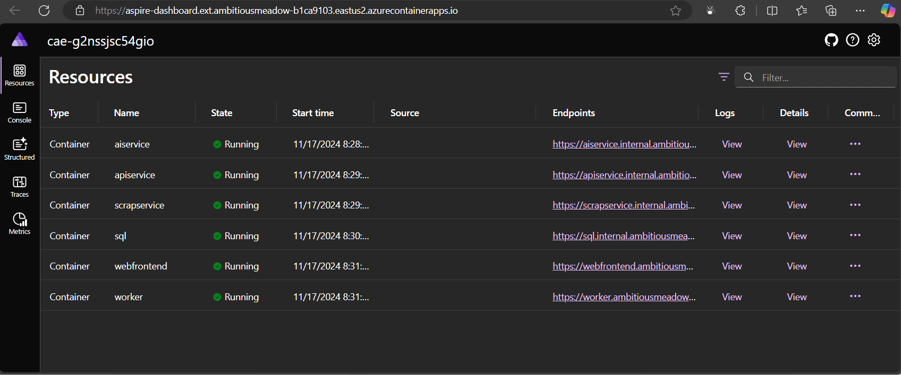
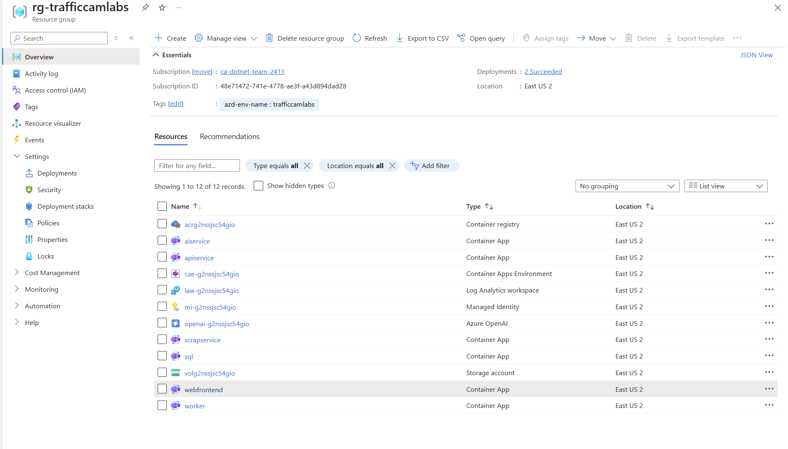
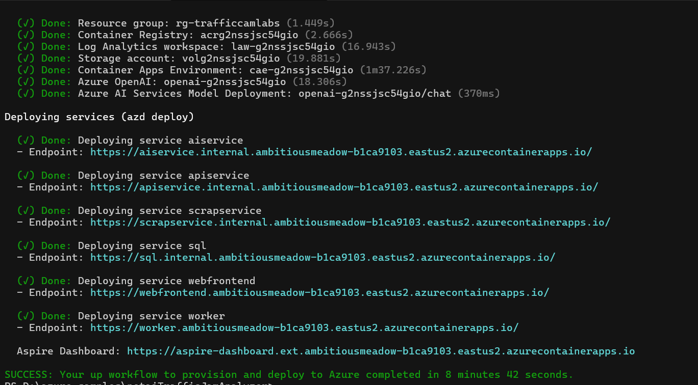
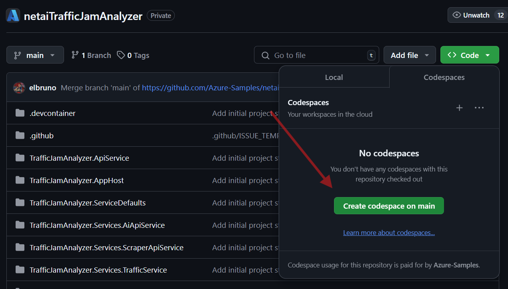
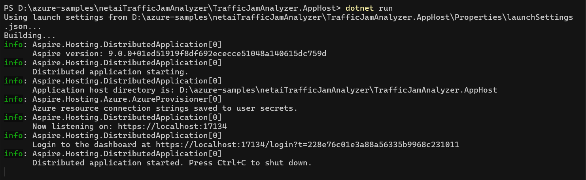

<!-- [](https://codespaces.new/Azure-Samples/netaitrafficjamanalyzer) -->

## Description

[](/LICENSE)
[](https://twitter.com/elbruno)


TrafficJamAnalyzer is an advanced tool designed to help monitor and analyze traffic conditions by processing images from CCTV cameras around the roads of Tenerife. [Tenerife CCTV Cameras Source](https://cic.tenerife.es/web3/mosaico_cctv/camaras_trafico_b.html)

By utilizing artificial intelligence (AI) with Semantic Kernel and OpenAI, the application accurately assesses traffic density and identifies locations with potential traffic jams.

- [Features](#features)
- [Architecture diagram](#architecture-diagram)
- [Getting started](#getting-started)
- [Deploying to Azure](#deploying)
- Run solution
  <!-- - [Run in CodeSpaces](#run-in-github-codespaces) -->
  - [Run locally](#run-locally)
  - [Run the solution](#run-the-solution)
- [Resources](#resources)
- [Video Recordings](#video-recordings)
- [Guidance](#guidance)
  - [Costs](#costs)
  - [Security Guidelines](#security-guidelines)
- [Resources](#resources)

## Features

<!-- **(Coming soon!) GitHub CodeSpaces:** This project is designed to be opened in GitHub Codespaces as an easy way for anyone to try out these libraries entirely in the browser. -->

This is the Camera Traffic Jam Aplication running:



The Aspire Dashboard to check the running services:



There Azure Resource Group with all the deployed services:



## Architecture diagram

COMING SOON!

## Getting Started

The solution is in the root folder, the main solution is **[TrafficJamAnalyzer.sln](./TrafficJamAnalyzer.sln)**.

## Deploying

Once you've opened the project in [Codespaces](#run-in-github-codespaces), or [locally](#run-locally), you can deploy it to Azure.

From a Terminal window, open the folder with the clone of this repo and run the following commands.

1. Login to Azure:

    ```shell
    azd auth login
    ```

1. Provision and deploy all the resources:

    ```shell
    azd up
    ```

    It will prompt you to provide an `azd` environment name (like "trafficjamdev"), select a subscription from your Azure account, and select a [location where OpenAI is available](https://azure.microsoft.com/explore/global-infrastructure/products-by-region/?products=cognitive-services&regions=all) (like "eastus2").

1. When `azd` has finished deploying, you'll see the list of resources created in Azure and a set of URIs in the command output.

1. Visit the **webfrontend** URI, and you should see the **Traffic Jam Camera Analyzer app**! 🎉

1. This is an example of the command output:



<!-- ### Run in GitHub CodeSpaces

1. Create a new  Codespace using the `Code` button at the top of the repository.



1. The Codespace creation process can take a couple of minutes.

1. Once the Codespace is loaded, it should have all the necessary requirements to run the demo projects. -->

### Run Locally

To run the project locally, you'll need to make sure the following tools are installed:

- [.NET 9](https://dotnet.microsoft.com/downloads/)
- [Git](https://git-scm.com/downloads)
- [Azure Developer CLI (azd)](https://aka.ms/install-azd)
- [Visual Studio Code](https://code.visualstudio.com/Download) or [Visual Studio](https://visualstudio.microsoft.com/downloads/)
  - If using Visual Studio Code, install the [C# Dev Kit](https://marketplace.visualstudio.com/items?itemName=ms-dotnettools.csdevkit)
- .NET Aspire workload:
    Installed with the [Visual Studio installer](https://learn.microsoft.com/en-us/dotnet/aspire/fundamentals/setup-tooling?tabs=windows&pivots=visual-studio#install-net-aspire) or the [.NET CLI workload](https://learn.microsoft.com/en-us/dotnet/aspire/fundamentals/setup-tooling?tabs=windows&pivots=visual-studio#install-net-aspire).
- An OCI compliant container runtime, such as:
  - [Docker Desktop](https://www.docker.com/products/docker-desktop/) or [Podman](https://podman.io/).

### Run the solution

Follow these steps to run the project, locally or in CodeSpaces:

- Navigate to the Aspire Host folder project using the command:

```bash
cd ./TrafficJamAnalyzer.AppHost/
```

- Run the project:

```bash
dotnet run
```

- You can expect an output similar to this one:



## Guidance

### Costs

For **Azure OpenAI Services**, pricing varies per region and usage, so it isn't possible to predict exact costs for your usage.
The majority of the Azure resources used in this infrastructure are on usage-based pricing tiers.
However, Azure Container Registry has a fixed cost per registry per day.

You can try the [Azure pricing calculator](https://azure.com/e/2176802ea14941e4959eae8ad335aeb5) for the resources:

- Azure OpenAI Service: S0 tier, gpt-4o model. Pricing is based on token count. [Pricing](https://azure.microsoft.com/pricing/details/cognitive-services/openai-service/)
- Azure Container App: Consumption tier with 0.5 CPU, 1GiB memory/storage. Pricing is based on resource allocation, and each month allows for a certain amount of free usage. [Pricing](https://azure.microsoft.com/pricing/details/container-apps/)
- Azure Container Registry: Basic tier. [Pricing](https://azure.microsoft.com/pricing/details/container-registry/)
- Log analytics: Pay-as-you-go tier. Costs based on data ingested. [Pricing](https://azure.microsoft.com/pricing/details/monitor/)

⚠️ To avoid unnecessary costs, remember to take down your app if it's no longer in use, either by deleting the resource group in the Portal or running `azd down`.

### Security Guidelines

Samples in this templates uses Azure OpenAI Services with ApiKey and [Managed Identity](https://learn.microsoft.com/entra/identity/managed-identities-azure-resources/overview) for authenticating to the Azure OpenAI service.

The Main Sample uses Managed Identity](https://learn.microsoft.com/entra/identity/managed-identities-azure-resources/overview) for authenticating to the Azure OpenAI service.

Additionally, we have added a [GitHub Action](https://github.com/microsoft/security-devops-action) that scans the infrastructure-as-code files and generates a report containing any detected issues. To ensure continued best practices in your own repository, we recommend that anyone creating solutions based on our templates ensure that the [Github secret scanning](https://docs.github.com/code-security/secret-scanning/about-secret-scanning) setting is enabled.

You may want to consider additional security measures, such as:

- Protecting the Azure Container Apps instance with a [firewall](https://learn.microsoft.com/azure/container-apps/waf-app-gateway) and/or [Virtual Network](https://learn.microsoft.com/azure/container-apps/networking?tabs=workload-profiles-env%2Cazure-cli).

## Resources

### Video Recordings

[](https://www.youtube.com/watch?v=AdV1tVGmmhQ)
